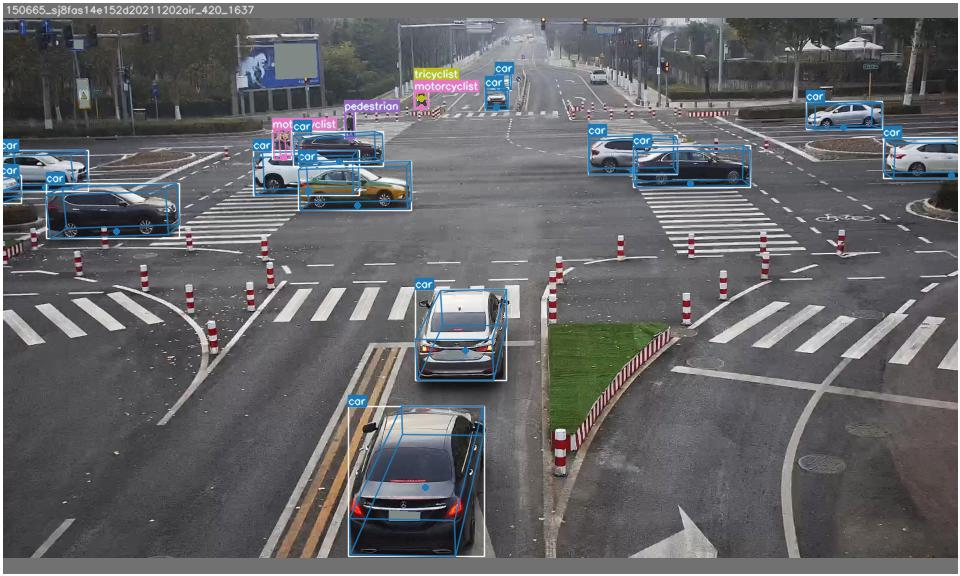
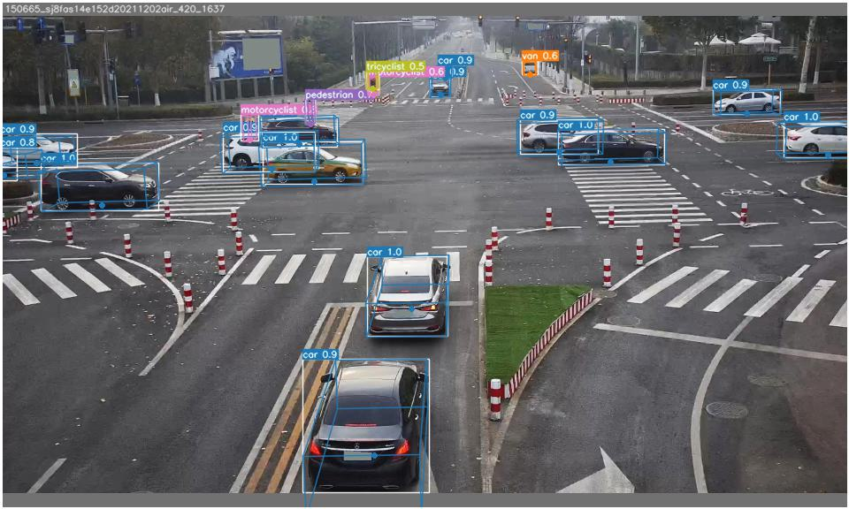

# 基于YOLOv7的单目3D检测方案

本方案尚未完成，当前工作：
**3d指标正确评测**

## 一、数据集
**百度rope3d，路端数据**

## 二、模型架构
先采用基础版的YOLOv7，后续可升级YOLOv7 E6E

## 三、损失函数
除原有的2d损失（cls, obj, bbox）之外，增加3dbbox损失

代码工作：
1. build_targets 

    根据loss选择，进行标签转换

2. 3d bbox loss 
    
    3d中心点投影偏移：L1
    深度：LaplacianAleatoricUncertaintyLoss
    3d尺寸：L1（DimAwareL1经常出现梯度问题）
    角度：L1

    后续有待优化

3. 损失权重，需进行实验设置

## 四、训练过程
按照常规端到端训练方法进行训练和调参

## 五、初步效果

